# Red Social Estudiantil - Frontend

Grupo 6

## APK

- https://drive.google.com/drive/folders/1zTuPVimV2fv03rJciv9yDXWG2eTASL19?usp=sharing

## Web

- http://ec2-52-90-109-184.compute-1.amazonaws.com/#/

## Flutter

- Flutter bloc
- Socket io client
- Push notifications (Next)
- http

## Backend - NodeJs

- https://github.com/MiguelAML/gviernes_grupo6_backend_fisi

---

## Screenshots

<table border>
    <tr>
        <th style="text-align:center">Inicio</th>
        <th style="text-align:center">Historias</th>
        <th style="text-align:center">Buscar</th>
    </tr>
    <tr>
        <td>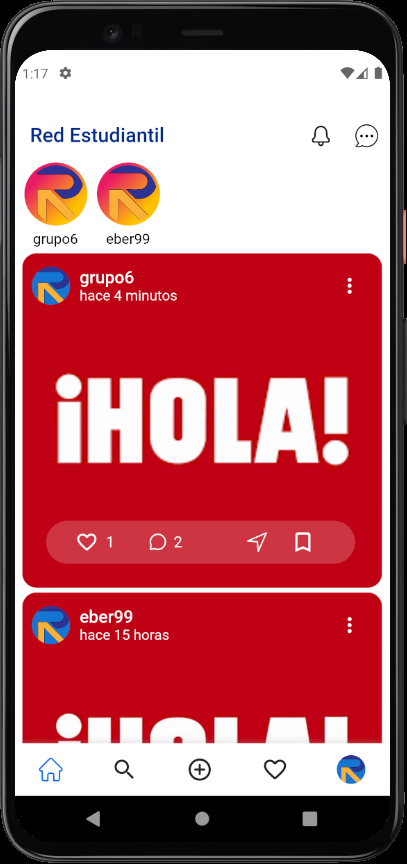</td>
        <td></td>
        <td>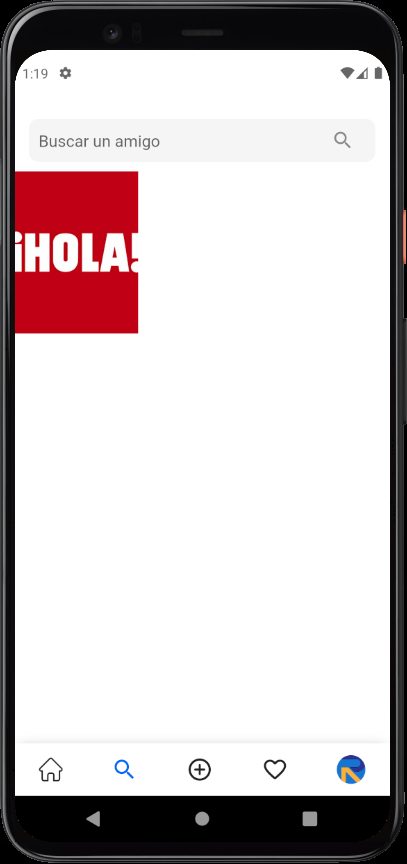</td>
    <tr>
</table>

<table border>
    <tr>
        <th style="text-align:center">Ver foto</th>
        <th style="text-align:center">Buscar usuario</th>
        <th style="text-align:center">Perfil de otro usuario</th>
    </tr>
    <tr>
        <td></td>
        <td>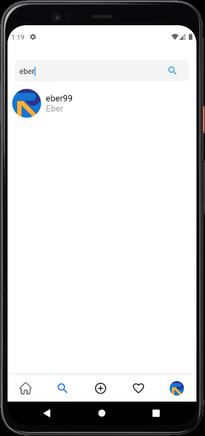</td>
        <td>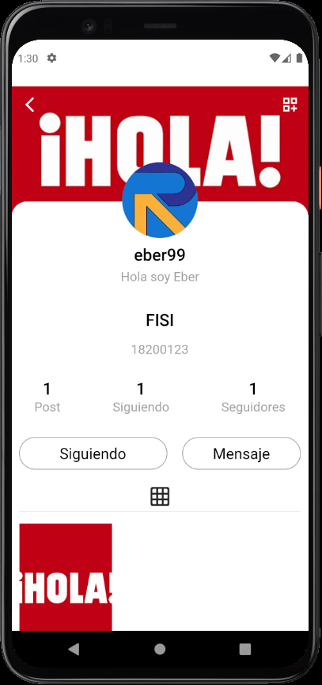</td>
    <tr>
</table>

<table border>
    <tr>
        <th style="text-align:center">Agregar post</th>
        <th style="text-align:center">Agregar post</th>
        <th style="text-align:center">Privacidad de post</th>
    </tr>
    <tr>
        <td>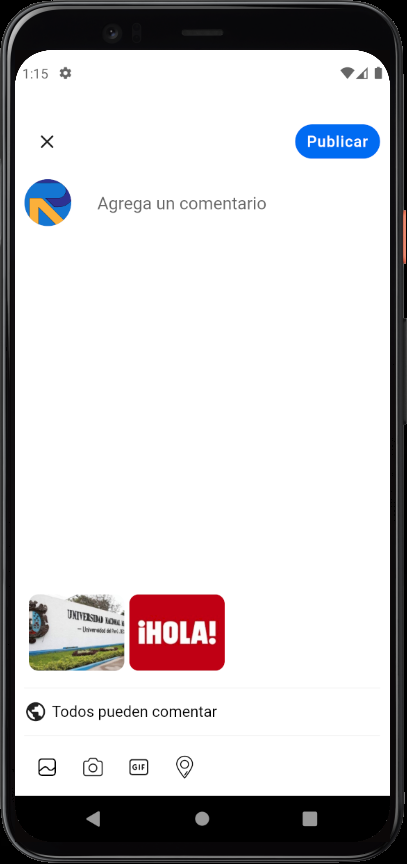</td>
        <td></td>
        <td>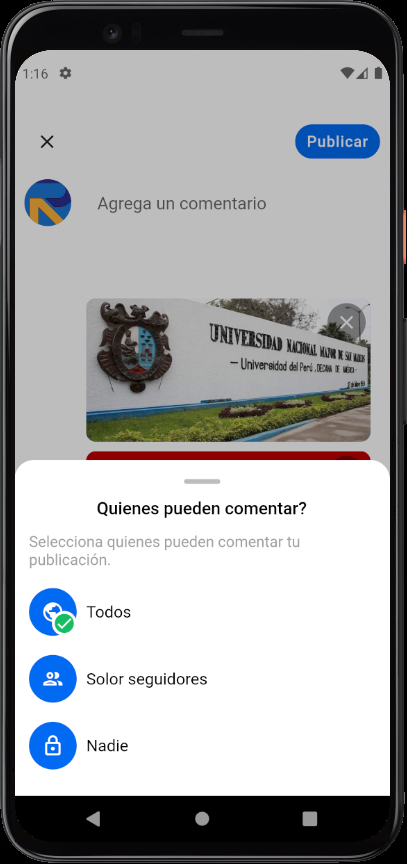</td>
    <tr>
</table>

<table border>
    <tr>
        <th style="text-align:center">Actividad</th>
        <th style="text-align:center">Perfil</th>
        <th style="text-align:center">Cambios de perfil</th>
    </tr>
    <tr>
        <td>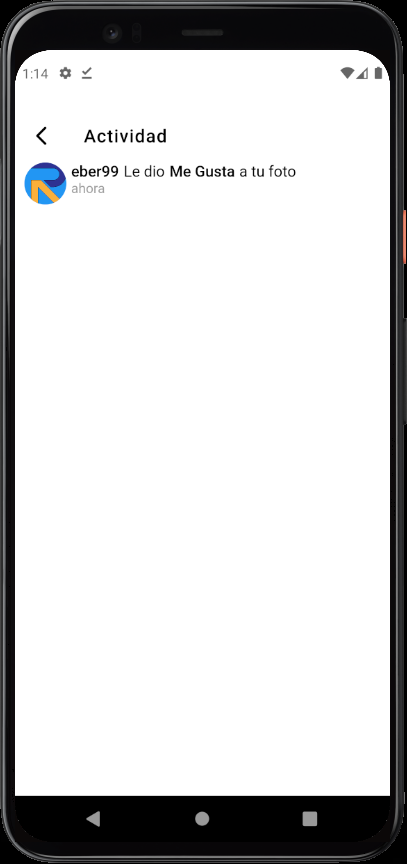</td>
        <td>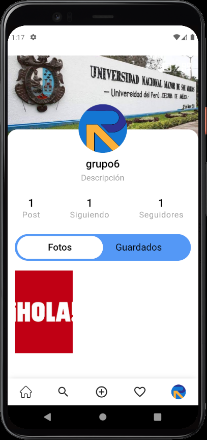</td>
        <td>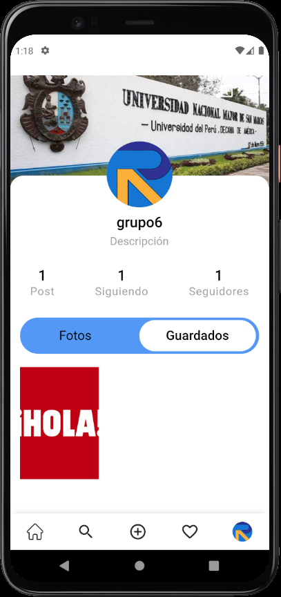</td>
    <tr>
</table>

<table border>
    <tr>
        <th style="text-align:center">Seguidos</th>
        <th style="text-align:center">Seguidores</th>
        <th style="text-align:center">Configuraciones</th>
    </tr>
    <tr>
        <td>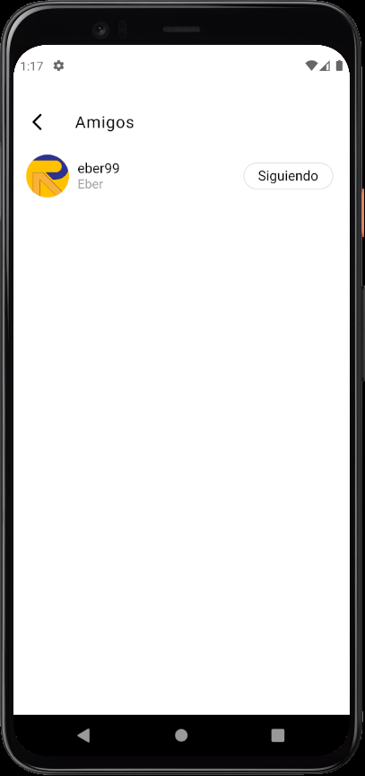</td>
        <td>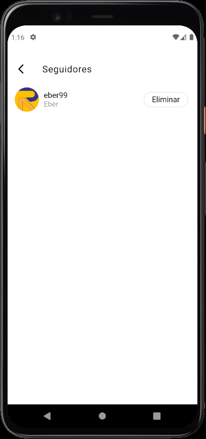</td>
        <td>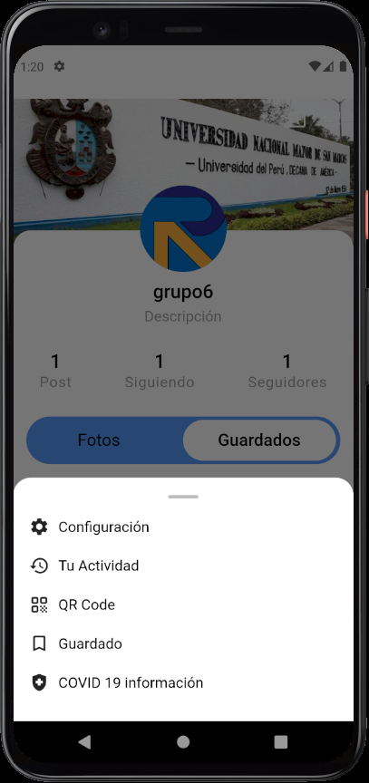</td>
    <tr>
</table>

<table border>
    <tr>
        <th style="text-align:center">Configuraciones</th>
        <th style="text-align:center">Privacidad</th>
        <th style="text-align:center">Seguridad</th>
    </tr>
    <tr>
        <td>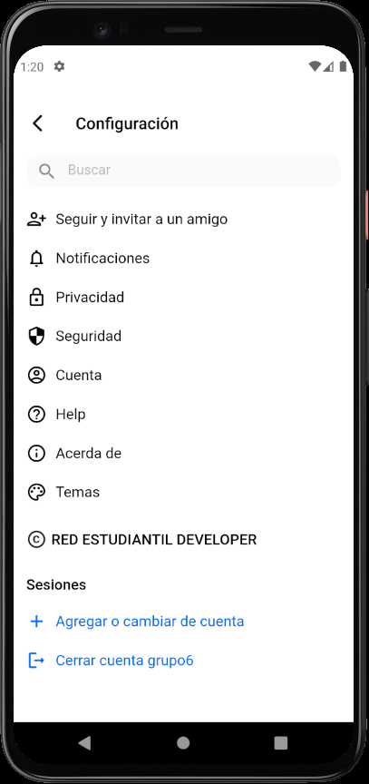</td>
        <td>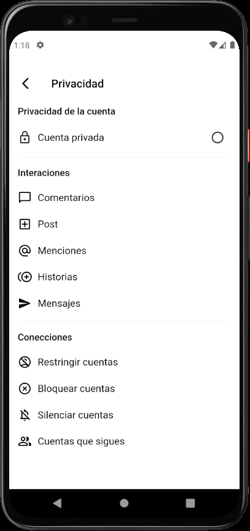</td>
        <td>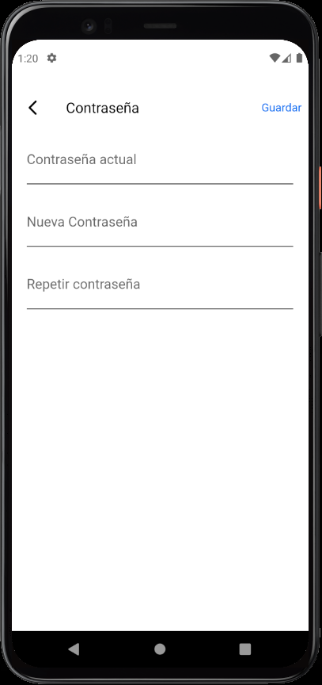</td>
    <tr>
</table>

<table border>
    <tr>
        <th style="text-align:center">Cuenta</th>
        <th style="text-align:center">Mensajes</th>
        <th style="text-align:center">Chat</th>
    </tr>
    <tr>
        <td>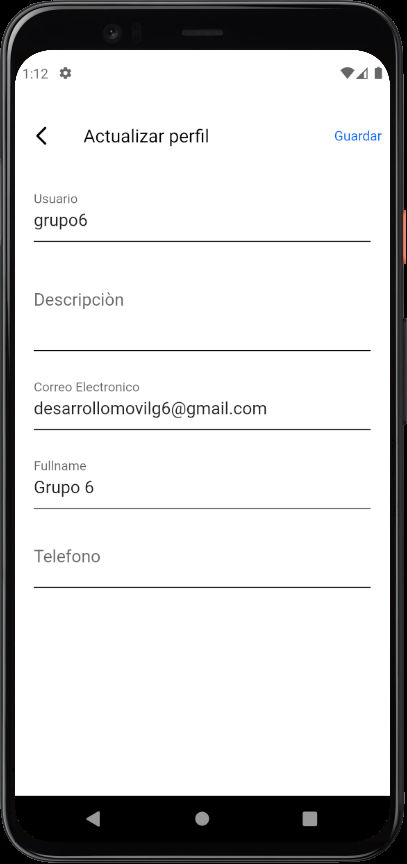</td>
        <td>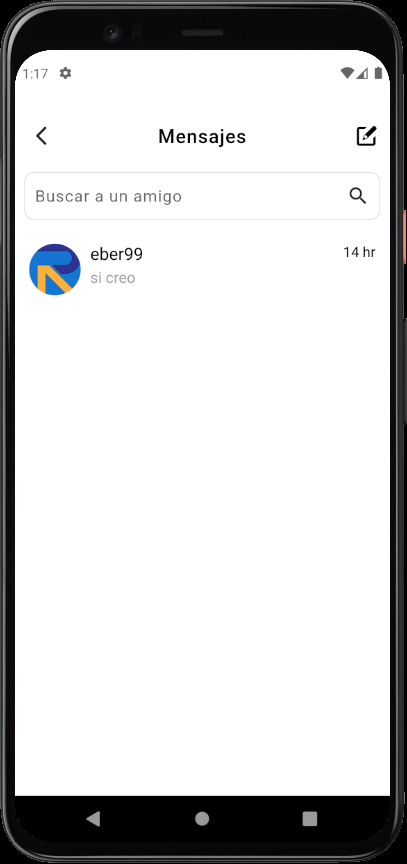</td>
        <td>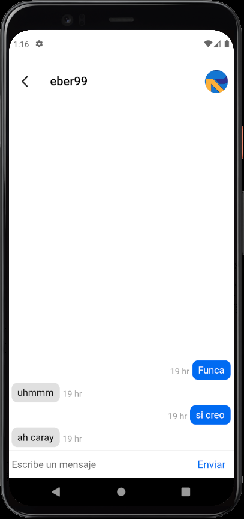</td>
    <tr>
</table>
